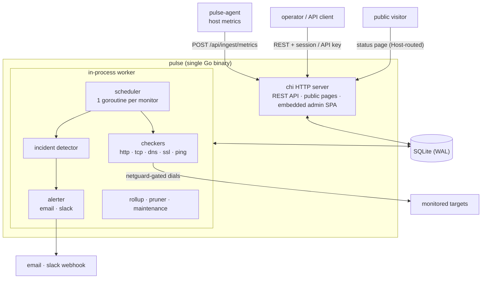
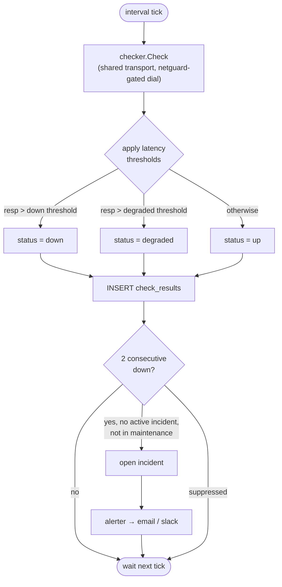

# Pulse

[](https://github.com/memetics19/pulse/actions/workflows/ci.yml)
[](.github/workflows/ci.yml)
[](.github/workflows/ci.yml)
[](.github/workflows/ci.yml)
[](go.work)
[](LICENSE.md)

> Coverage is enforced in CI per module (excluding generated code); the badges
> show the gate each module must clear. See the `go` job in
> [`.github/workflows/ci.yml`](.github/workflows/ci.yml) and
> [`scripts/coverage.sh`](scripts/coverage.sh).

Pulse is an open-source, self-hosted status page and monitoring tool. It ships as a single Go binary with a SQLite database. The monitoring worker runs in the same process, so there is no separate database server, Node.js runtime, or reverse proxy required to run it. Pulse checks your services, records uptime and latency, opens incidents when checks fail, and serves public status pages on your own domains.

A live status page runs at [status.shreeda.xyz](https://status.shreeda.xyz). The full documentation is at [docs.shreeda.xyz](https://docs.shreeda.xyz).

<!---->

## Highlights

- **Single binary and SQLite.** One Go binary plus one SQLite file. The monitoring worker runs in-process.
- **Multiple status pages on custom domains.** Each page has its own domain, title, and selected monitor groups. Pulse resolves the page from the request Host header.
- **Scoped API keys.** Named, revocable keys with granular scopes (for example `monitors:read`, `incidents:write`). Keys are shown once at creation and stored as a hash.
- **Built-in theming.** Presets, logo and favicon upload, a customizable footer, CSS variable overrides, per-page branding, and a visitor dark-mode toggle.
- **Structured incidents with required RCA.** A defined lifecycle from detected to resolved. A root cause analysis is required before an incident can be resolved.
- **Scheduled maintenance with alert suppression.** Maintenance windows transition automatically. While a window is active, alerts and auto-incidents are suppressed for the affected monitors.
- **TOTP two-factor authentication.** Optional time-based one-time passwords using an authenticator app.
- **Atom feed.** The public page exposes an Atom feed for incident updates.
- **Local-timezone rendering.** All times render in the visitor's local timezone.

## Architecture

Pulse runs as one Go binary with an in-process monitoring worker and a single
SQLite file. The optional `pulse-agent` pushes host metrics; everything else —
REST API, public status pages, and the embedded admin SPA — is served from the
same process.



Each monitor runs on its own interval. One check flows through latency
thresholds, gets recorded, and — after two consecutive failures with no active
maintenance window — opens an incident and fires alerts:



## Quick start (60 seconds)

Pulse is a single static binary — no Docker or runtime dependencies. The
installer detects your OS and CPU architecture (Linux/macOS, amd64/arm64),
downloads and checksum-verifies the matching binary, and installs it. It asks a
few questions (port, data directory, HTTPS, homelab LAN monitoring). On Linux it
sets up an auto-starting `systemd` service:

```bash
curl -fsSL https://raw.githubusercontent.com/memetics19/pulse/main/deploy/install.sh | sh
```

Prefer containers? Run it with Docker Compose instead:

```bash
git clone https://github.com/memetics19/pulse.git
cd pulse
docker compose up -d
```

Open `http://localhost:8080`. On first start, every route redirects to a setup wizard. Create the admin account, set branding, and choose the SQLite path. After setup the app runs normally.

To serve a public page such as `status.shreeda.xyz` over HTTPS, run a reverse proxy in front of Pulse that terminates TLS and forwards to port 8080. See the status pages documentation for Caddy and nginx examples.

## Documentation

Full documentation is at [docs.shreeda.xyz](https://docs.shreeda.xyz). The Markdown sources live in [`docs/`](docs/index.md):

- [Getting started](docs/getting-started.md)
- [Configuration](docs/configuration.md)
- [Monitors](docs/monitors.md)
- [Incidents](docs/incidents.md)
- [Maintenance](docs/maintenance.md)
- [Status pages](docs/status-pages.md)
- [Theming](docs/theming.md)
- [API](docs/api.md)
- [Security](docs/security.md)
- [Architecture](docs/architecture.md)
- [Roadmap](docs/roadmap.md)

## License

Pulse is released under the MIT License. See [LICENSE.md](LICENSE.md).
