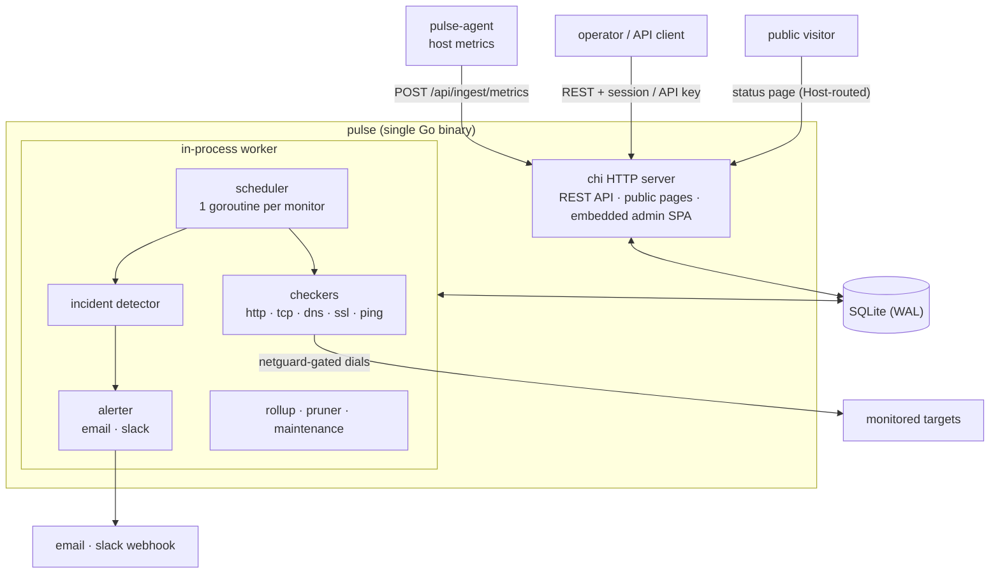
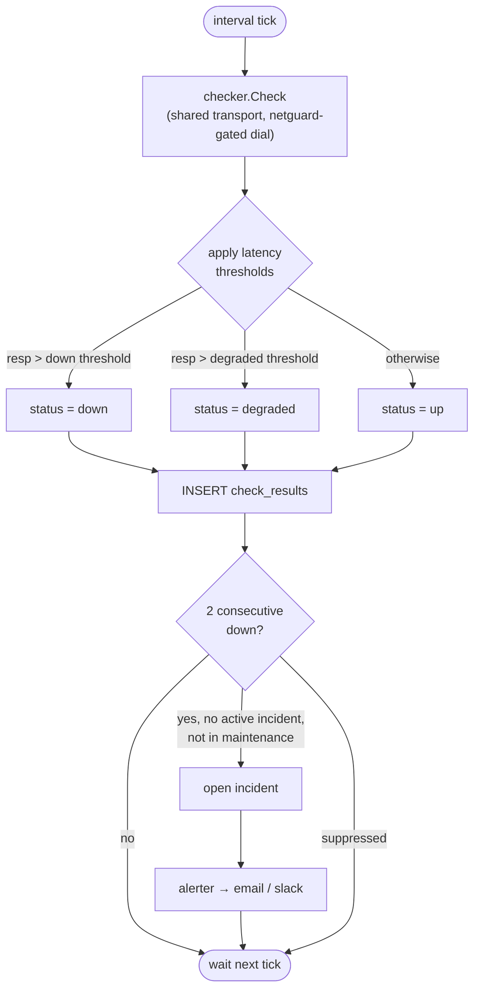

# Architecture

Pulse is built to run as a single process with a single data file. This page describes how the parts fit together.

## Overview

## Check lifecycle

## Single binary

Pulse ships as one Go binary. The Docker image is a static binary on Alpine with ca-certificates. There is no separate database server, Node.js runtime, or reverse proxy required to run it. You may still place a reverse proxy in front of Pulse to terminate TLS for custom domains. See [Status pages](status-pages.md).

## In-process worker

The monitoring worker runs inside the same process as the HTTP server. The worker:

- Runs scheduled checks for each monitor.
- Records results and computes up, degraded, and down status.
- Auto-creates an incident after two consecutive down checks for a monitor.
- Transitions maintenance windows through their states at their boundaries.
- Suppresses alerts and auto-incidents for monitors under an active maintenance window.
- Prunes raw check history older than the retention window.

Because the worker is in-process, there is no separate scheduler service to deploy or coordinate.

## Embedded admin

The admin interface is built as static assets and embedded into the Go binary. The binary serves both the public status pages and the admin from the same process. There are no separate frontend and backend services to deploy.

## SQLite

SQLite is the only data store. A single file holds the admin account, monitors and groups, check history, incidents and updates, maintenance windows, status pages, themes, API keys, and notification settings. The path is set by `SQLITE_PATH`. See [Configuration](configuration.md) for persistence guidance.

## Host-based page resolution

Pulse serves multiple [status pages](status-pages.md) from one process. It resolves which page to show from the request Host header. A request on a configured page domain renders that page with its selected groups, branding, and scoped incidents and maintenance. A request on an unknown host falls back to the default page, which shows all groups.

## Infra agent

The `pulse-agent` binary runs on a host you want to monitor and pushes CPU, memory, disk, and network metrics to Pulse. Because the agent pushes outbound, no inbound port is required on the monitored host. The metrics feed `infra` type monitors.
